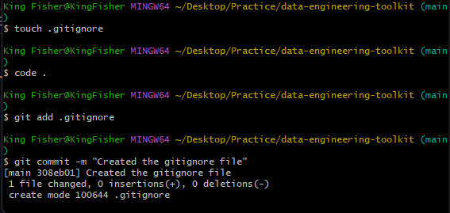
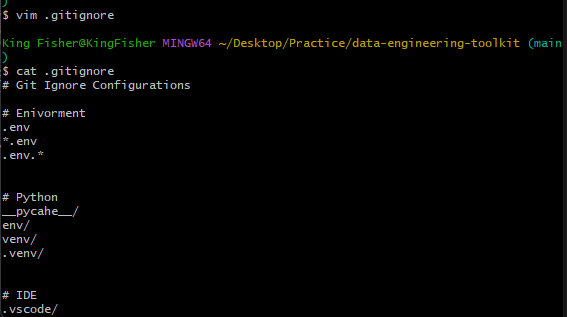
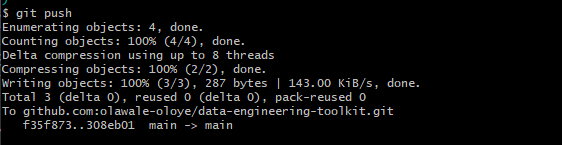

# data-engineering-toolkit

Data Engineering Community - LaunchPad Mentorship Programme : Git Task

# Documentation

1. Create new github repository named "data-engineering-toolkit" with a description and an empty readme.md
2. Clone the repository to local machine using "git clone git@github.com:olawale-oloye/data-engineering-toolkit.git" on gitbash
3. Add a gitignore file using the terminal: "touch .gitignore"
4. Add the file to the repository
      

6. Push the files to github
      

7. Update the gitignore file using vim
      

8. Create an env for secrets
9. Install Python Virtual Environment (venv) named as ".venv" using "python -m venv .venv"
10. Install relevant libraries (pandas, seaborn, matplotlib, requests, psycopg2)
11. Develop requirements.txt using "pip freeze >> requirements.txt"

# Code Examples

# Contribution Guide
